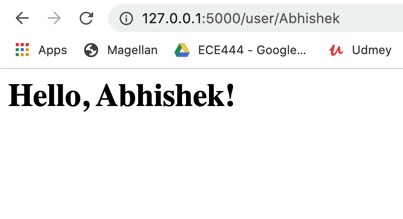

# ECE444-F2020-Lab2

This repo is a clone of https://github.com/miguelgrinberg/flasky

**Activity1:-**

**Activity2:-**

**Activity3:-**

When Flask receives a request from a client, it needs to make some objects available to the view functions that will handle the request. 
Instead of giving functions access to the object by sending it as an argument, Flask uses **contexts** to temporarily make certain objects **globally accessible**. 
This way every single function will not have to have an extra argument for accessing the object.
